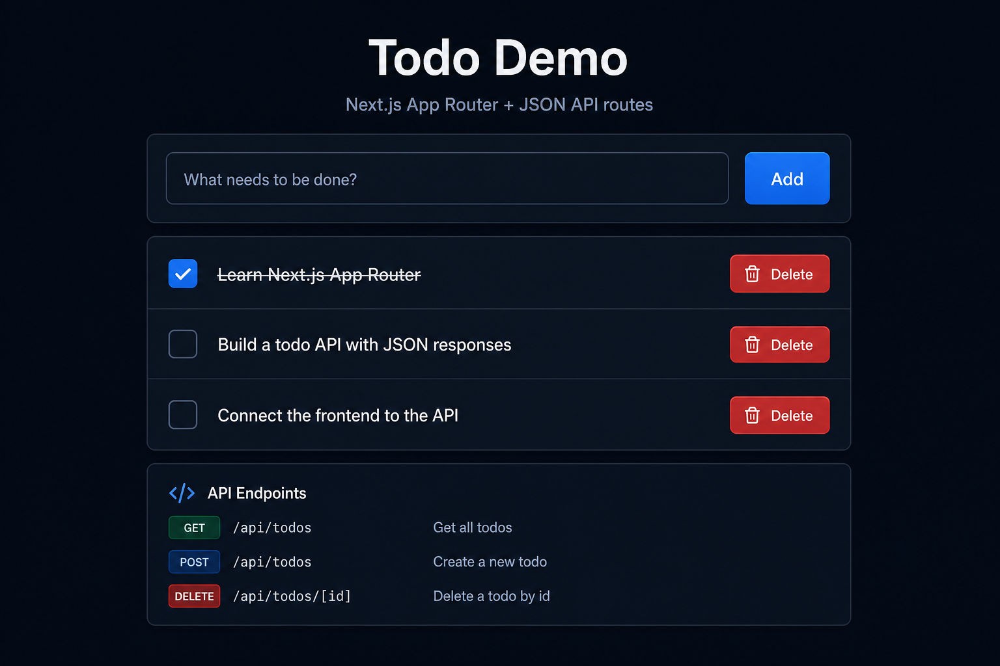

# Next.js Todo Demo

A full-stack todo application built with **Next.js 15** and the **App Router**. It includes JSON REST API routes and a client-side UI that communicates with them via `fetch`.


---

## Preview



---

## Table of Contents

- [Preview](#preview)
- [Features](#features)
- [Tech Stack](#tech-stack)
- [Getting Started](#getting-started)
- [API Reference](#api-reference)
- [Project Structure](#project-structure)
- [Scripts](#scripts)
- [License](#license)

---

## Features

- **Todo CRUD** — Add, complete, and delete todos from the UI
- **REST API** — JSON endpoints under `/api/todos`
- **Consistent responses** — Every API call returns `{ success, data | error }`
- **TypeScript** — Shared types across frontend and backend
- **In-memory store** — Simple demo data layer (resets on server restart)
- **Dark UI** — Clean, responsive interface

---

## Tech Stack

| Layer      | Technology                          |
| ---------- | ----------------------------------- |
| Framework  | [Next.js 15](https://nextjs.org/)   |
| UI         | [React 19](https://react.dev/)      |
| Language   | [TypeScript](https://www.typescriptlang.org/) |
| Styling    | CSS Modules + global CSS            |
| API        | Next.js Route Handlers (App Router) |

---

## Getting Started

### Prerequisites

- [Node.js](https://nodejs.org/) 18.18 or later
- npm, yarn, or pnpm

### Installation

1. **Clone the repository**

   ```bash
   git clone https://github.com/YOUR_USERNAME/h-c-temp.git
   cd h-c-temp
   ```

2. **Install dependencies**

   ```bash
   npm install
   ```

3. **Start the development server**

   ```bash
   npm run dev
   ```

4. **Open the app**

   Visit [http://localhost:3000](http://localhost:3000) in your browser.

### Production build

```bash
npm run build
npm run start
```

---

## API Reference

Base URL: `http://localhost:3000`

All endpoints return JSON in this format:

**Success**

```json
{
  "success": true,
  "data": {}
}
```

**Error**

```json
{
  "success": false,
  "error": "Error message"
}
```

### Endpoints

| Method   | Endpoint           | Description        |
| -------- | ------------------ | ------------------ |
| `GET`    | `/api/todos`       | List all todos     |
| `POST`   | `/api/todos`       | Create a todo      |
| `GET`    | `/api/todos/:id`   | Get a single todo  |
| `PATCH`  | `/api/todos/:id`   | Update a todo      |
| `DELETE` | `/api/todos/:id`   | Delete a todo      |

### Examples

**List todos**

```bash
curl http://localhost:3000/api/todos
```

```json
{
  "success": true,
  "data": [
    {
      "id": "1",
      "title": "Learn Next.js App Router",
      "completed": true,
      "createdAt": "2026-07-12T00:00:00.000Z"
    }
  ]
}
```

**Create a todo**

```bash
curl -X POST http://localhost:3000/api/todos \
  -H "Content-Type: application/json" \
  -d '{"title": "Buy groceries"}'
```

**Update a todo**

```bash
curl -X PATCH http://localhost:3000/api/todos/YOUR_ID \
  -H "Content-Type: application/json" \
  -d '{"completed": true}'
```

**Delete a todo**

```bash
curl -X DELETE http://localhost:3000/api/todos/YOUR_ID
```

---

## Project Structure

```
src/
├── app/
│   ├── api/todos/
│   │   ├── route.ts          # GET, POST  /api/todos
│   │   └── [id]/route.ts     # GET, PATCH, DELETE /api/todos/:id
│   ├── globals.css
│   ├── layout.tsx
│   └── page.tsx
├── components/
│   ├── TodoApp.tsx           # Client UI
│   └── todo-app.module.css
├── lib/
│   ├── api.ts                # Frontend fetch helpers
│   └── todo-store.ts         # In-memory data store
└── types/
    └── todo.ts               # Shared TypeScript types
```

---

## Scripts

| Command         | Description                |
| --------------- | -------------------------- |
| `npm run dev`   | Start dev server (Turbopack) |
| `npm run build` | Build for production       |
| `npm run start` | Run production server      |
| `npm run lint`  | Run ESLint                 |

---

## License

This project is licensed under the [MIT License](LICENSE).
